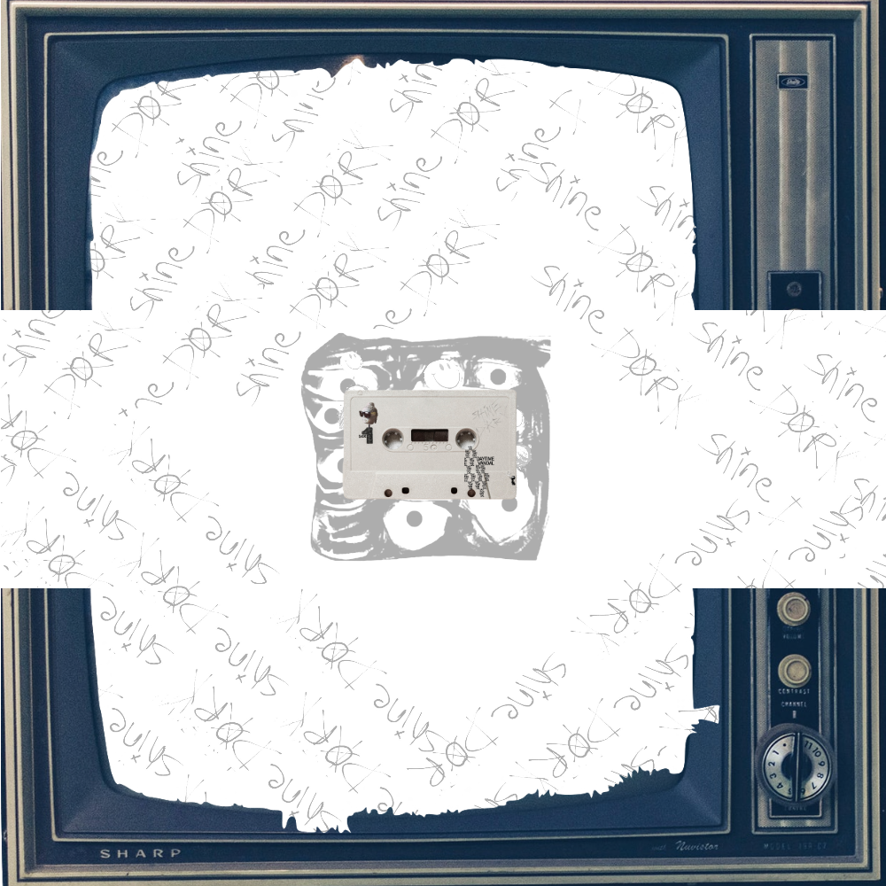
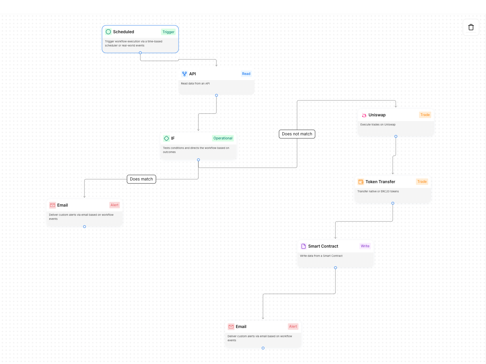
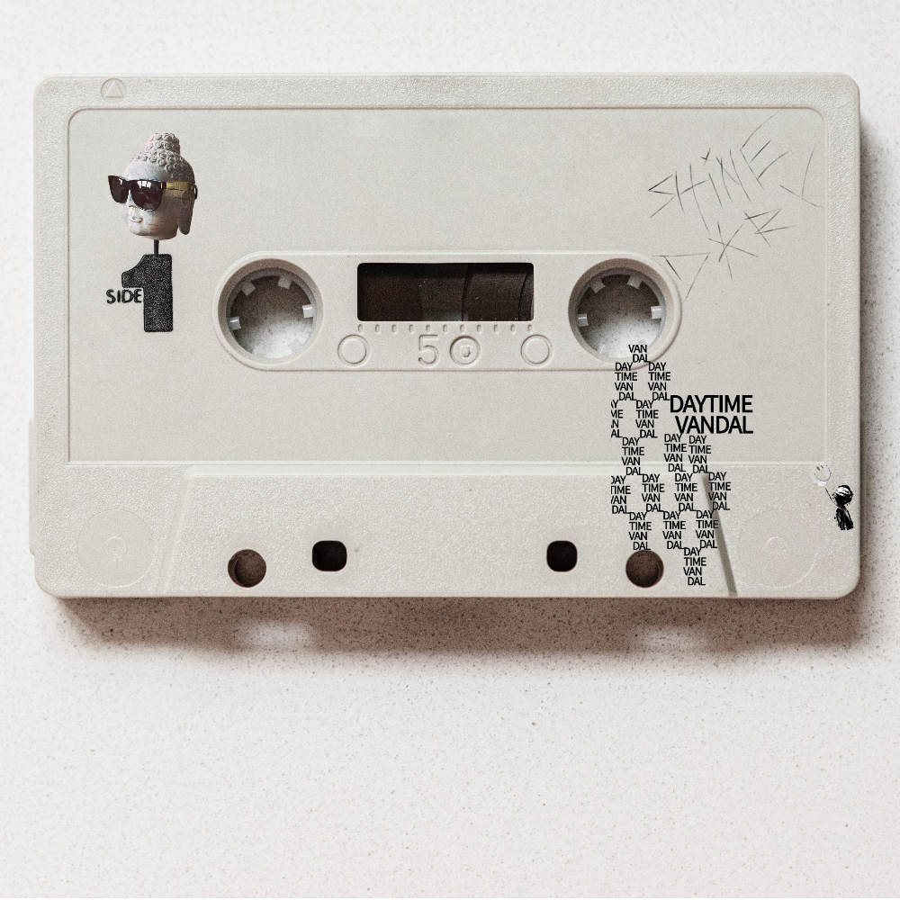

# SHINE DARK SOFT KILL JAMS Music Tokenization Project

### README: Music Tokenization Workflow Using K3 Labs

#### Overview

This project integrates **K3 Labs** functionality to bridge off-chain music streaming data with on-chain token economics. Using data from streaming platforms for an artist like [Shine Dark](https://music.apple.com/us/artist/shine-dark/993072837), we calculate a token's value based on music performance metrics and facilitate royalty management through blockchain mechanisms.

---

### MVP

For detailed MVP specifications, see [MVP Documentation](./MVP.md)

### Contributing

We welcome contributions from developers, music industry professionals, and blockchain enthusiasts! Here's how you can get involved:

1. **Fork & Clone**

   - Fork this repository
   - Clone your fork locally

2. **Areas for Contribution**

   - Streaming platform integrations
   - Smart contract improvements
   - Token economics modeling
   - Documentation enhancements
   - Testing and security audits

3. **How to Contribute**
   - Create a new branch for your feature
   - Submit a Pull Request with a clear description
   - Follow our coding standards (see CONTRIBUTING.md)

Join our community:

- X (Twitter): [Follow @ShineDarkmusic](https://x.com/ShineDarkmusic)
- Instagram: [Follow @shinedarkmusic](https://www.instagram.com/shinedarkmusic/)
- YouTube: [Subscribe](https://www.youtube.com/channel/UCVbJWtMZ4rF1SpDBLC2E8wg?view_as=subscriber)
- GitHub Discussions: Share ideas and feedback

For major changes, please open an issue first to discuss what you would like to change.

---

### Features

1. **Streaming Data Integration**

   - **Goal**: Leverage K3 Labs' data functions to import music streaming data for Shine Dark.
   - **Purpose**: Analyze streams to calculate token valuation metrics based on artist popularity and revenue generation.

2. **Token Valuation**

   - **Formula**: A custom profile is created that tracks streaming metrics, computes revenue projections, and determines token valuation in real-time.

3. **Royalties Management**

   - **Wallet Alerts**: Use K3 Labs' wallet alert system to notify when royalties are deposited.
   - **Fiat-to-Crypto Swap**: Integrate Uniswap to convert fiat royalties into a project token automatically.

4. **Staking via EigenLayer**

   - **Security Mechanism**: Stake project tokens via EigenLayer to enhance network security and incentivize token holders.

5. **Automation Workflows**
   - Create K3 workflows to:
     - Fetch streaming data (e.g., API integration with Apple Music or similar platforms).
     - Trigger token value updates.
     - Automate royalty-to-token conversions.

---

### Implementation Steps

1. **Data Retrieval**

   - Use K3 Labs’ **API Query Functions** to fetch Shine Dark's streaming data, including play count, listeners, and geographical performance.

2. **Tokenization Formula**

   - Create a weighted scoring system:
     - Streams (50%)
     - Listener engagement (30%)
     - Regional impact (20%)

3. **Wallet Integration**

   - Set up a K3-compatible wallet to receive royalties.
   - Configure alerts to notify royalty deposits.

4. **Fiat Conversion**

   - Connect the wallet to **Uniswap** using K3’s integration modules.
   - Automate fiat-to-token swaps with pre-defined triggers.

5. **Staking Infrastructure**
   - Utilize **EigenLayer** to allow staking of tokens by investors or fans, securing the network and providing additional rewards.

---

### Example Workflow

**For Shine Dark’s Streaming Activity**:

1. **Streams**: 1,000,000 plays in a month.
2. **Royalties**: \$4,000 received.
3. **Token Value**: Updated using the formula.
4. **Conversion**: \$4,000 converted into tokens and distributed to stakeholders.
5. **Staking**: Tokens are staked via EigenLayer for added security.

---

### Requirements

- **K3 Labs Account**
- **Streaming API Access** (Apple Music, Spotify, etc.)
- **Blockchain Wallet**
- **Uniswap and EigenLayer Configuration**

---

### Connect & Follow

- 🎵 **Music Platforms**

  - [Apple Music](https://music.apple.com/us/artist/shine-dark/993072837)
  - [Spotify](https://open.spotify.com/artist/6Ch6jH9Q2wxd3im5IRYFoF)
  - [SoundCloud](https://soundcloud.com/shinedark)
  - [Mixcloud](https://www.mixcloud.com/shinedark/)

- 🌐 **Web & Portfolio**

  - [Official Website](https://www.shinedarkmusic.com/)
  - [Code Portfolio](https://shinedark.dev/)

- 📱 **Social Media**

  - [X (Twitter)](https://x.com/ShineDarkmusic)
  - [Instagram](https://www.instagram.com/shinedarkmusic/)
  - [YouTube](https://www.youtube.com/channel/UCVbJWtMZ4rF1SpDBLC2E8wg?view_as=subscriber)
  - [Twitch](https://www.twitch.tv/shinedarkmusic)

- 💿 **Support**
  
  - [Buy Vinyl](https://www.paypal.com/ncp/payment/RVBUJR3MTSYB2)

---

### Live Development Streams 🎥

We believe in transparent and collaborative development! Join us on Twitch where we stream our development process live:

- **Watch Live**: [twitch.tv/shinedarkmusic](https://www.twitch.tv/shinedarkmusic)

During streams, you can:

- See real-time development
- Ask questions about the codebase
- Suggest features and improvements
- Learn about blockchain and music tokenization
- Participate in technical discussions
- See me produce music , dj , create stuff

Follow our [Twitch channel](https://www.twitch.tv/shinedarkmusic) to get notified when we go live!

---

### Future Enhancements

- Expand integration with multiple streaming platforms.
- Add NFT-based rewards for top token holders.
- Enable community voting using staked tokens for artist-specific projects.

---

This README outlines a proof-of-concept for transforming music streams into a tangible on-chain token economy, driving artist and fan engagement while leveraging cutting-edge blockchain tools.

AI HELPED !!! will you?

